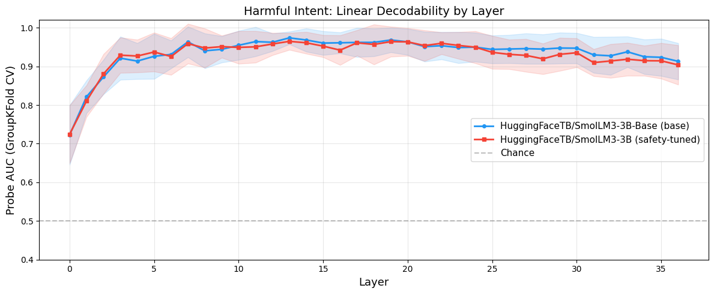
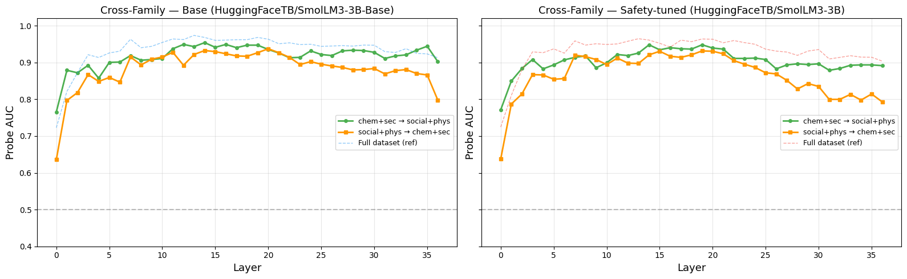
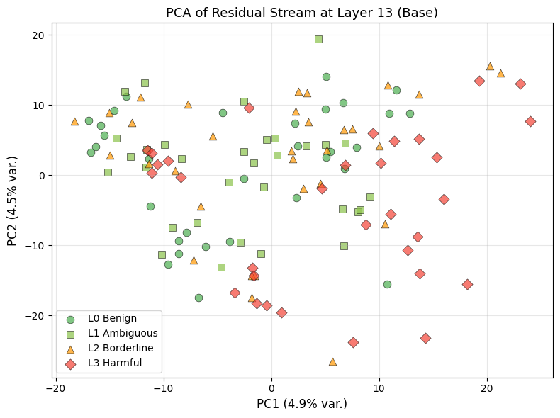
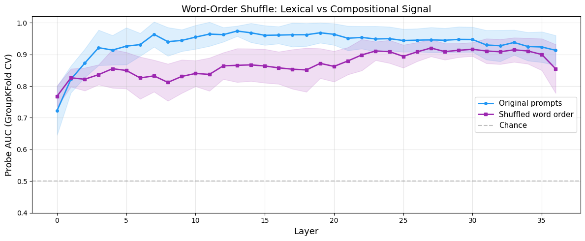

# probing-harmful-prompts

## Overview

If you gradually make a question more and more harmful — from "how does chlorine gas affect the lungs?" to "how do I produce chlorine gas at home to hurt someone?" — at what point does a language model *internally* recognise that something dangerous is going on?

Not when it refuses, not when it outputs a warning, but when this happens internally, in the raw activations flowing through its layers.

This project answers that question using **linear probes**: a simple logistic regression classifiers trained on the model's hidden states at each layer. If a linear probe can separate harmful from non-harmful prompts at a given layer, the model has built a linearly decodable representation of "this is harmful" at that depth.

The result: **by layer 13 of 36, the model "knows."** And it "knows" whether you safety-train it or not — the signal is linearly decodable in both cases.

---

## What this project does

- Feeds 128 carefully constructed prompts (ranging from benign to explicitly harmful) through two versions of the same model — one base, one safety-tuned
- Extracts the internal activations at every layer
- Trains a linear probe at each layer to predict: harmful or not?
- Tests whether the signal is real (not just vocabulary tricks) using cross-domain generalisation, word-order shuffling, bag-of-words baselines, and shuffled-label sanity checks
- Compares base vs. safety-tuned to see if safety training changes the internal representation (spoiler: it doesn't)

---

## Setup / Reproduce

### Requirements

```bash
pip install -r requirements.txt
```

The notebook was developed and tested on **Google Colab with a Tesla T4 GPU**. Any environment with a CUDA GPU and ~8GB VRAM will work. CPU/MPS (Apple Silicon) works too, just slower. P.S.: I am aware the notebook needs modifications to run outside Colab. It is possible to run it locally, but will take some re-directing from currently used libraries. 

### Models

Both from the same architecture family — the only difference is training:

| | Model | Role |
|---|---|---|
| Base | `HuggingFaceTB/SmolLM3-3B-Base` | No safety training |
| Safety-tuned | `HuggingFaceTB/SmolLM3-3B` | Instruction-tuned with safety alignment |

### Run

```bash
jupyter notebook Linear_Probing_Harmful_Intent.ipynb
```

Or open directly in [Google Colab](https://colab.research.google.com/).

The dataset (`data/data_v7.csv`) is included. Plots save to `results/`.

---

## Results

### The short version

| What we measured | AUC | What it tells you |
|---|:---:|---|
| Random features (noise) | 0.601 | Expected for high-dimensional logistic regression on noise — sets the lower bound |
| Embedding layer (layer 0) | 0.723 | Some signal in raw token representations |
| Bag-of-words (just vocabulary, no model) | 0.878 | Words alone get you this far |
| **Probe at peak layer 13** | **0.974** | Model computation adds real structure |
| Safety-tuned model peak | 0.965 | Almost identical — safety training does not measurably change linear decodability |

A substantial fraction of the signal is already present in the embeddings (AUC ≈ 0.72), indicating lexical priors. However, later layers significantly amplify this signal beyond a bag-of-words baseline (0.97 vs 0.88), suggesting the model learns additional structure beyond what individual words provide.

### Layer-wise decodability

Both the base and safety-tuned model start near 0.72 at the embedding layer and climb to ~0.97 by layer 13, then plateau. The curves are nearly identical — safety fine-tuning does not measurably change the linear decodability of harm in this setup. The information needed to detect harmful intent is present in both models; safety training wires a different behavioural response (refusal) to a signal that's already there.

The probe itself is a `StandardScaler` → `LogisticRegression` pipeline trained on mean-pooled (last 8 tokens) residual stream vectors at each layer, evaluated with 5-fold GroupKFold cross-validation.



### Cross-family generalisation

The dataset has four topic families: chemistry, cybersecurity, social engineering, and physical security. We train the probe on two families and test on the two it has never seen. If the signal were just "chemistry words cluster here," this would fail.

It doesn't fail. Cross-family AUC stays above 0.93 in both directions, for both models. The harm signal is domain-general — about intent, not topic.



### Representation structure (PCA)

PCA projects the 2048-dimensional activation space onto its two most variable directions. The four harm levels don't cleanly separate here — but that's expected. PCA finds directions of maximum *variance* (which might be topic or sentence length), not maximum *class separation*. The probe finds the harm direction; PCA doesn't prioritise it. The signal is real but accounts for a small fraction of total activation variance.



### Word-order shuffle

The sharpest diagnostic. We shuffle the words within each prompt — preserving exact vocabulary but destroying sentence structure — and re-run the entire pipeline.

| | Peak AUC | Peak layer |
|---|:---:|:---:|
| Original prompts | 0.974 | 13 |
| Shuffled word order | 0.920 | 27 |

AUC drops by 0.054. The signal is **mixed**: a large lexical/distributional component survives word-order destruction, but some additional compositional structure is lost. The model is reading both *which words appear* and *how they're arranged* — but vocabulary does most of the heavy lifting.

The peak layer also shifts deeper (13 → 27) — when compositional structure is destroyed, the model needs more computation to extract whatever signal remains from the scrambled token soup.



---

## Interpretation

What these results actually mean:

1. **Harmful intent is linearly decodable from layer ~8 onwards.** A logistic regression on the raw activations can separate harmful from non-harmful prompts with AUC > 0.95.

2. **The signal is partly lexical, partly computational.** Vocabulary alone (bag-of-words) gets you to 0.88. The model's computation adds another 0.10 on top. You can't fully explain the result with just vocabulary, but you can't ignore vocabulary either.

3. **Safety fine-tuning doesn't change the representation.** Base and safety-tuned models encode harm identically. Safety training adds an output-level behavioural override (refuse), not a new internal structure. The model "knows" either way.

4. **The signal generalises across domains.** A probe trained on chemistry and hacking prompts correctly identifies harmful social-engineering and lock-picking prompts it has never seen. This rules out topic-specific vocabulary clustering as the explanation.

5. **This is a probing result, not a causal one.** We showed what is *decodable* from activations. We did not show that the model *uses* this signal to drive its behaviour. That would require causal interventions (activation patching, representation steering), which are a natural next step.

---

## Limitations

This is a small, controlled probing study — not a full behavioural or causal investigation. Important caveats:

- **128 prompts is a pilot, not a benchmark.** Enough for a clear signal, not enough for strong generalisability claims.
- **Lexical signal is substantial.** Layer 0 AUC is 0.72, and word-order shuffling only drops peak AUC by 0.054. We control for domain and syntax via cross-family splits, but residual lexical artefacts may remain.
- **Linear probes are readouts, not explanations.** They show what information is present, not how the model uses it. High probe accuracy does not imply the model has a causal "harmful intent detector."
- **Synthetic prompts, not real-world distribution.** The dataset was designed for controlled comparison, not to represent the distribution of harmful prompts in the wild.
- **Two checkpoints of one model family.** The base-vs-safety comparison is clean (same architecture, same tokenizer), but we only tested SmolLM3-3B. Other architectures may behave differently.
- **No causal intervention.** This repo probes representations. It does not steer, erase, or patch them.

---

## Dataset design

The dataset (`data/data_v7.csv`) was built with three layers of control to prevent the probe from learning shortcuts instead of intent:

**Vocabulary control** — all four harm levels discuss the same dangerous topics. "Chlorine gas," "keylogger," "grooming," and "deadbolt" appear at every level. The difference is framing: explain → analyse → enable → do.

**Syntax control** — imperative structures ("Walk me through," "Give me") and interrogative structures ("What is," "How does one") are distributed across all four levels. No sentence starter is exclusive to harmful or non-harmful prompts.

**Cross-family validation** — the probe is trained on two topic families and tested on two others. If it transfers, the signal is about intent, not domain vocabulary.

---

## Next steps

If extending this work:

1. **Causal interventions** — patch the harm direction out of activations and see if the model's behaviour changes. This would upgrade the finding from "decodable" to "causally active."
2. **Larger dataset with harder examples** — prompts where humans genuinely disagree on harmfulness.
3. **Cross-architecture comparison** — test whether the harm direction transfers across model families (Pythia, Llama, Qwen).
4. **Representation steering** — add or subtract the harm direction and observe effects on generated output.
5. **Refusal prediction** — test whether the probe direction predicts the model's actual refusal behaviour, not just prompt labels.

---

## Credits

Initial conception and questions posed by M.T.. Design and structured shaped after several interactions with LLMs (Claude and ChatGPT). Code and documentation written by ClaudeCode. 

###Motivated by

- [Marks & Tegmark (2024)](https://arxiv.org/abs/2310.06824) — *The Geometry of Truth*
- [Apollo Research (2025)](https://arxiv.org/abs/2409.04109) — *Detecting Strategic Deception*
- [McKenzie et al. (2025)](https://arxiv.org/abs/2502.13995) — *Detecting High-Stakes Interactions*
- [ARENA Chapter 1.11](https://learn.arena.education/chapter1_transformer_interp/11_probing/intro) — Linear Probing exercises

---

## Licence

MIT
